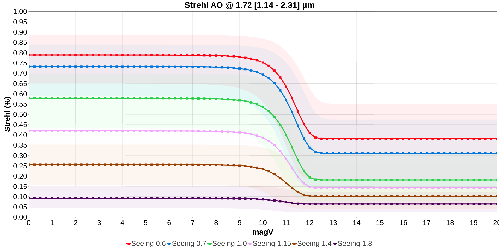
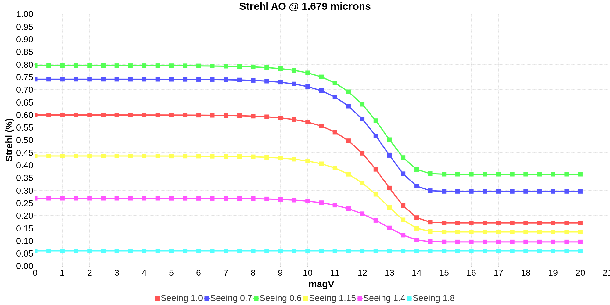
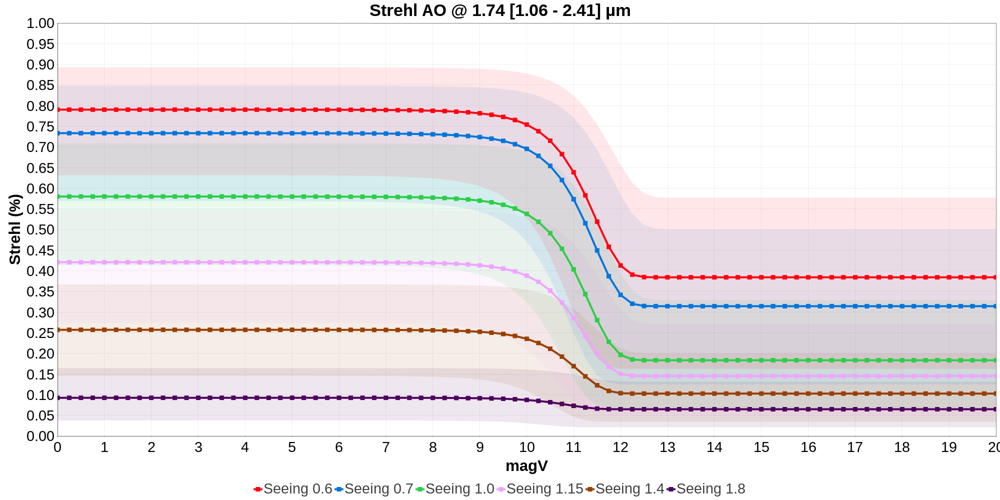
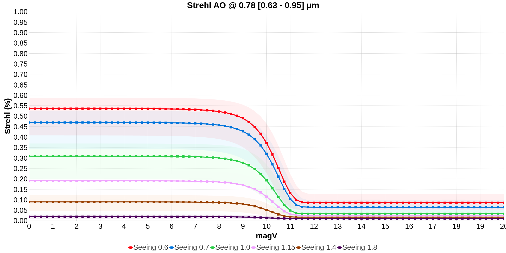
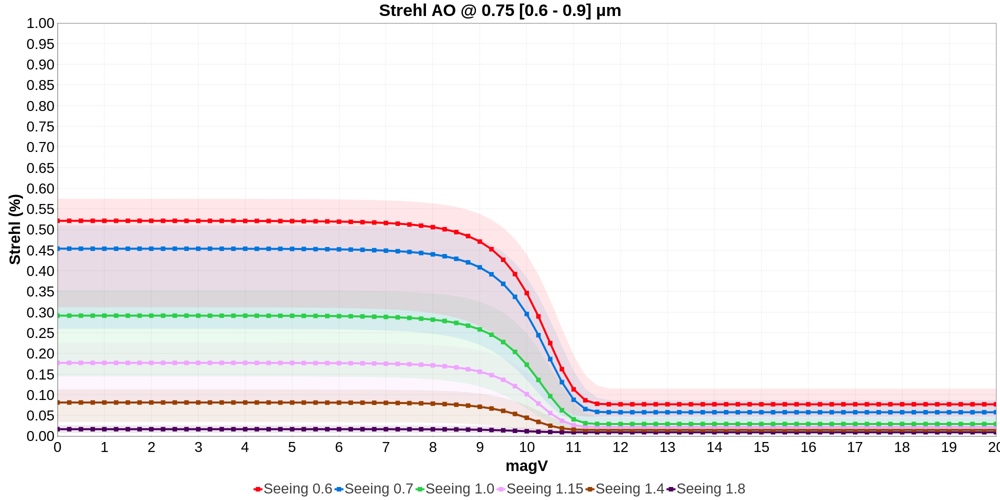

# ASPRO 2 - Strehl ratios per instrument, telescope and Adaptive Optics (AO) systems

Date: Fri Mar 08 14:53:41 GMT 2024

InterferometerConfiguration: CHARA 2024B

## FocalInstrument: CLASSIC

Instrument band: H
Instrument central wavelength : 1.7286000000000001 µm

### Telescope: T

Telescope diameter (m): 1.0

#### Adaptive Optics: AO_CHARA

AO band: V

- AO setup: AO

  - AO band: V
  - AO nbSubPupils: 36
  - AO nbActuators: 24
  - AO td: 2.0
  - AO ron: 5.0
  - AO qe: 0.7

  

## FocalInstrument: CLIMB

Instrument band: H
Instrument central wavelength : 1.7286000000000001 µm

### Telescope: T

Telescope diameter (m): 1.0

#### Adaptive Optics: AO_CHARA

AO band: V

- AO setup: AO

  - AO band: V
  - AO nbSubPupils: 36
  - AO nbActuators: 24
  - AO td: 2.0
  - AO ron: 5.0
  - AO qe: 0.7

  

## FocalInstrument: MIRCX-MYSTIC

Instrument band: H
Instrument central wavelength : 1.74025 µm

### Telescope: T

Telescope diameter (m): 1.0

#### Adaptive Optics: AO_CHARA

AO band: V

- AO setup: AO

  - AO band: V
  - AO nbSubPupils: 36
  - AO nbActuators: 24
  - AO td: 2.0
  - AO ron: 5.0
  - AO qe: 0.7

  

## FocalInstrument: PAVO

Instrument band: I
Instrument central wavelength : 0.79 µm

### Telescope: T

Telescope diameter (m): 1.0

#### Adaptive Optics: AO_CHARA

AO band: V

- AO setup: AO

  - AO band: V
  - AO nbSubPupils: 36
  - AO nbActuators: 24
  - AO td: 2.0
  - AO ron: 5.0
  - AO qe: 0.7

  

## FocalInstrument: SPICA

Instrument band: I
Instrument central wavelength : 0.7518 µm

### Telescope: T

Telescope diameter (m): 1.0

#### Adaptive Optics: AO_CHARA

AO band: V

- AO setup: AO

  - AO band: V
  - AO nbSubPupils: 36
  - AO nbActuators: 24
  - AO td: 2.0
  - AO ron: 5.0
  - AO qe: 0.7

  

