

# ASPRO 2 - Strehl ratios per instrument, telescope and Adaptive Optics (AO) systems

Date: Mon Mar 04 10:52:10 GMT 2024

InterferometerConfiguration: VLTI Period 113

## FocalInstrument: PIONIER

Instrument band: H

### Telescope: UT

Telescope diameter (m): 8.0

#### Adaptive Optics: AO_GPAO_NGS_VIS

AO band: R

- AO setup: GPAO_NGS_VIS

  - AO band: R
  - AO nbSubPupils: 1200
  - AO nbActuators: 800
  - AO td: 1.0
  - AO ron: 0.25
  - AO qe: 0.25

  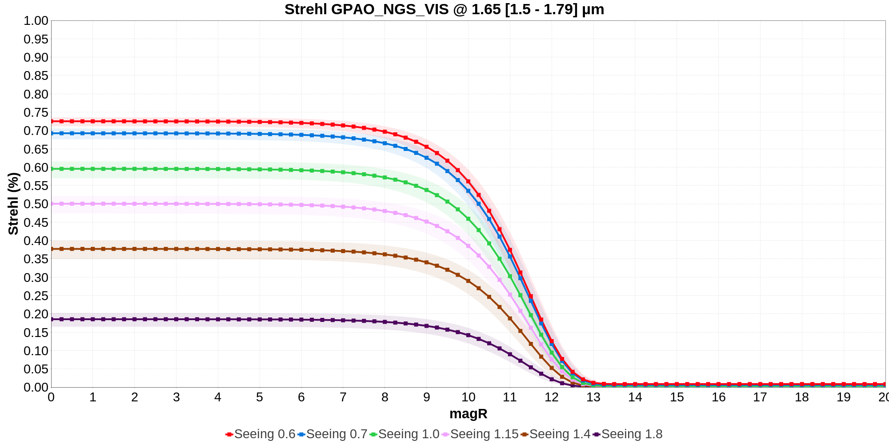

#### Adaptive Optics: AO_MACAO

AO band: V

- AO setup: MACAO

  - AO band: V
  - AO nbSubPupils: 60
  - AO nbActuators: 50
  - AO td: 0.8
  - AO ron: 1.0
  - AO qe: 0.7

  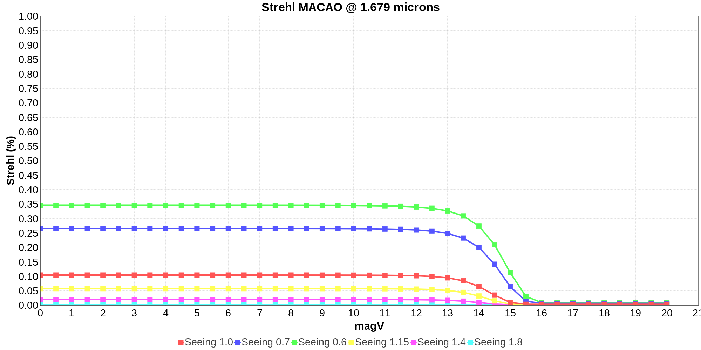

### Telescope: AT

Telescope diameter (m): 1.8

#### Adaptive Optics: AO_NAOMI

AO band: R

- AO setup: NAOMI_BRIGHT

  - AO band: R
  - AO nbSubPupils: 16
  - AO nbActuators: 15
  - AO td: 2.0
  - AO ron: 0.32
  - AO qe: 0.1

  

- AO setup: NAOMI_FAINT

  - AO band: R
  - AO nbSubPupils: 16
  - AO nbActuators: 7
  - AO td: 5.0
  - AO ron: 0.32
  - AO qe: 0.1

  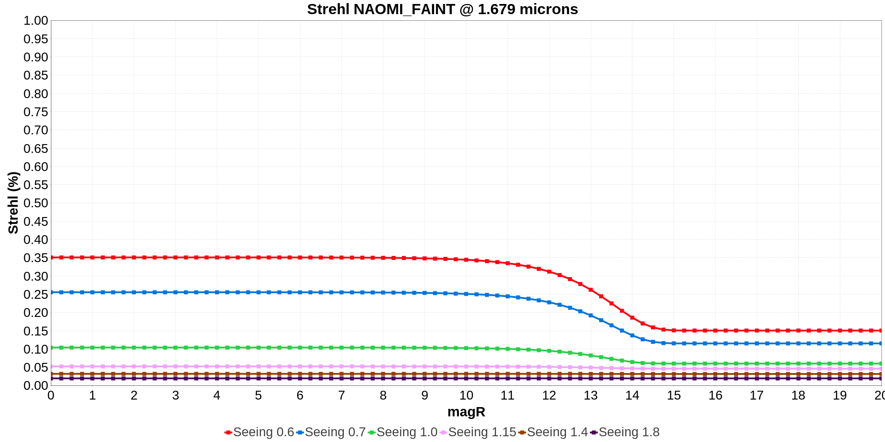

## FocalInstrument: GRAVITY

Instrument band: K

### Telescope: UT

Telescope diameter (m): 8.0

#### Adaptive Optics: AO_GPAO_NGS_VIS

AO band: R

- AO setup: GPAO_NGS_VIS

  - AO band: R
  - AO nbSubPupils: 1200
  - AO nbActuators: 800
  - AO td: 1.0
  - AO ron: 0.25
  - AO qe: 0.25

  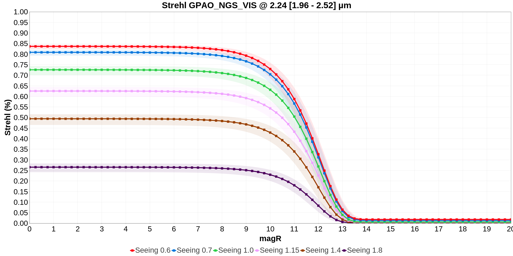

#### Adaptive Optics: AO_GPAO_NGS_IR

AO band: K

- AO setup: GPAO_NGS_IR

  - AO band: K
  - AO nbSubPupils: 81
  - AO nbActuators: 60
  - AO td: 2.0
  - AO ron: 60.0
  - AO qe: 0.7

  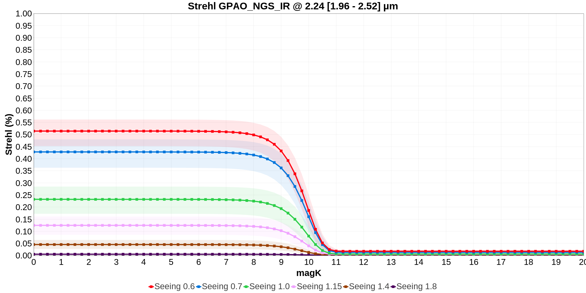

#### Adaptive Optics: AO_CIAO

AO band: K

- AO setup: CIAO_ON_AXIS

  - AO band: K
  - AO nbSubPupils: 81
  - AO nbActuators: 70
  - AO td: 2.0
  - AO ron: 30.0
  - AO qe: 0.7

  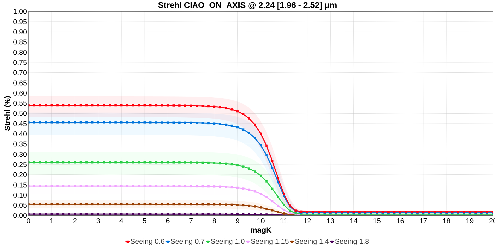

- AO setup: CIAO_OFF_AXIS

  - AO band: K
  - AO nbSubPupils: 81
  - AO nbActuators: 60
  - AO td: 2.0
  - AO ron: 60.0
  - AO qe: 0.7

  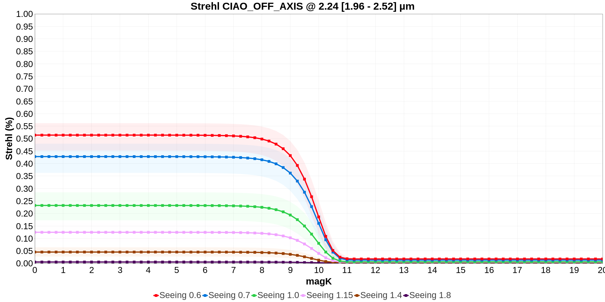

#### Adaptive Optics: AO_MACAO

AO band: V

- AO setup: MACAO

  - AO band: V
  - AO nbSubPupils: 60
  - AO nbActuators: 50
  - AO td: 0.8
  - AO ron: 1.0
  - AO qe: 0.7

  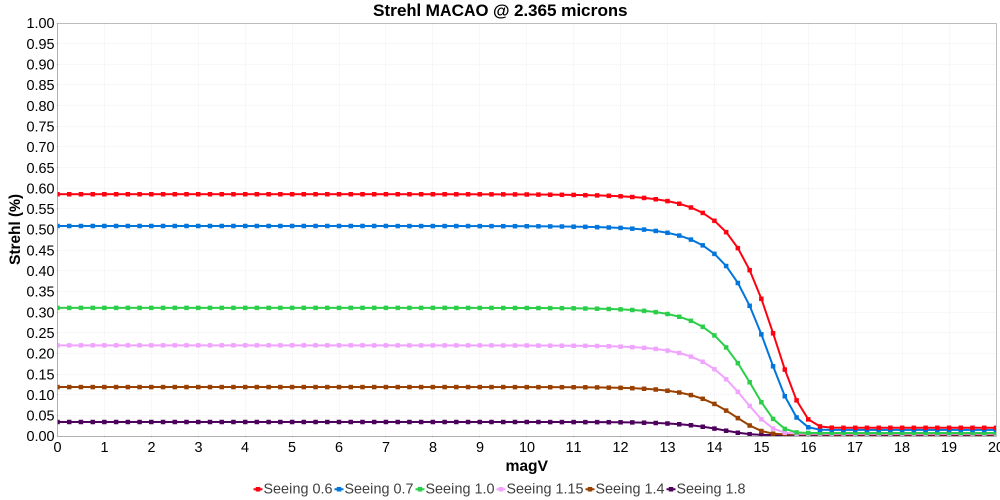

### Telescope: AT

Telescope diameter (m): 1.8

#### Adaptive Optics: AO_NAOMI

AO band: R

- AO setup: NAOMI_BRIGHT

  - AO band: R
  - AO nbSubPupils: 16
  - AO nbActuators: 15
  - AO td: 2.0
  - AO ron: 0.32
  - AO qe: 0.1

  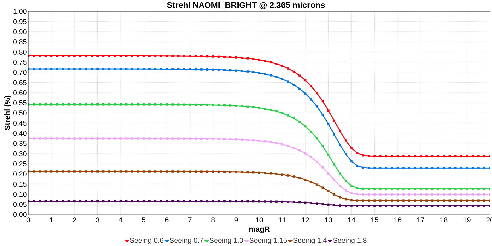

- AO setup: NAOMI_FAINT

  - AO band: R
  - AO nbSubPupils: 16
  - AO nbActuators: 7
  - AO td: 5.0
  - AO ron: 0.32
  - AO qe: 0.1

  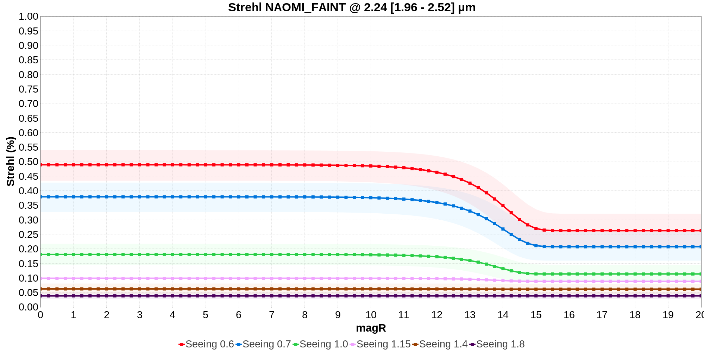

## FocalInstrument: MATISSE_LM

Instrument band: L

### Telescope: UT

Telescope diameter (m): 8.0

#### Adaptive Optics: AO_GPAO_NGS_VIS

AO band: R

- AO setup: GPAO_NGS_VIS

  - AO band: R
  - AO nbSubPupils: 1200
  - AO nbActuators: 800
  - AO td: 1.0
  - AO ron: 0.25
  - AO qe: 0.25

  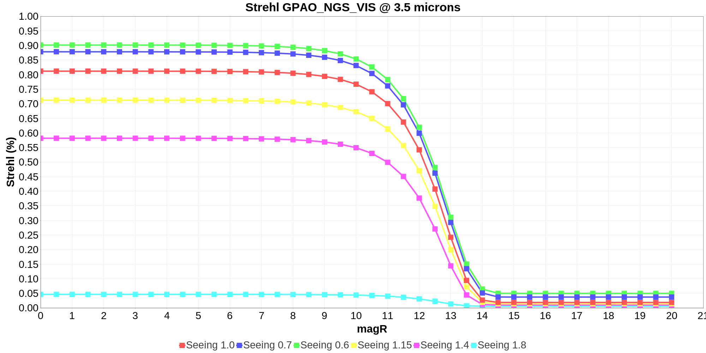

#### Adaptive Optics: AO_MACAO

AO band: V

- AO setup: MACAO

  - AO band: V
  - AO nbSubPupils: 60
  - AO nbActuators: 50
  - AO td: 0.8
  - AO ron: 1.0
  - AO qe: 0.7

  

### Telescope: AT

Telescope diameter (m): 1.8

#### Adaptive Optics: AO_NAOMI

AO band: R

- AO setup: NAOMI_BRIGHT

  - AO band: R
  - AO nbSubPupils: 16
  - AO nbActuators: 15
  - AO td: 2.0
  - AO ron: 0.32
  - AO qe: 0.1

  

- AO setup: NAOMI_FAINT

  - AO band: R
  - AO nbSubPupils: 16
  - AO nbActuators: 7
  - AO td: 5.0
  - AO ron: 0.32
  - AO qe: 0.1

  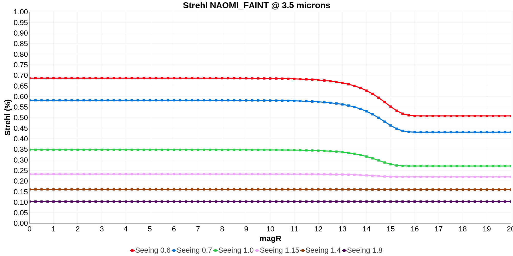

## FocalInstrument: MATISSE_N

Instrument band: N

### Telescope: UT

Telescope diameter (m): 8.0

#### Adaptive Optics: AO_GPAO_NGS_VIS

AO band: R

- AO setup: GPAO_NGS_VIS

  - AO band: R
  - AO nbSubPupils: 1200
  - AO nbActuators: 800
  - AO td: 1.0
  - AO ron: 0.25
  - AO qe: 0.25

  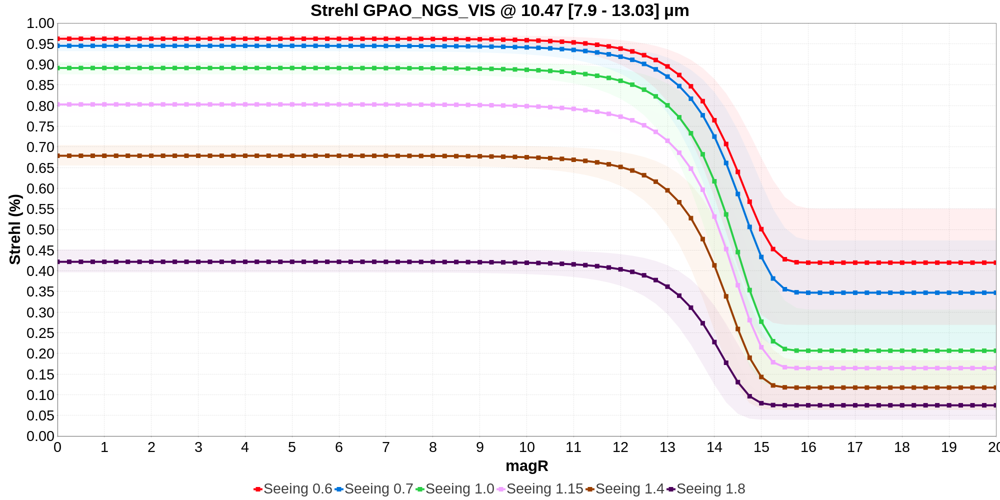

#### Adaptive Optics: AO_MACAO

AO band: V

- AO setup: MACAO

  - AO band: V
  - AO nbSubPupils: 60
  - AO nbActuators: 50
  - AO td: 0.8
  - AO ron: 1.0
  - AO qe: 0.7

  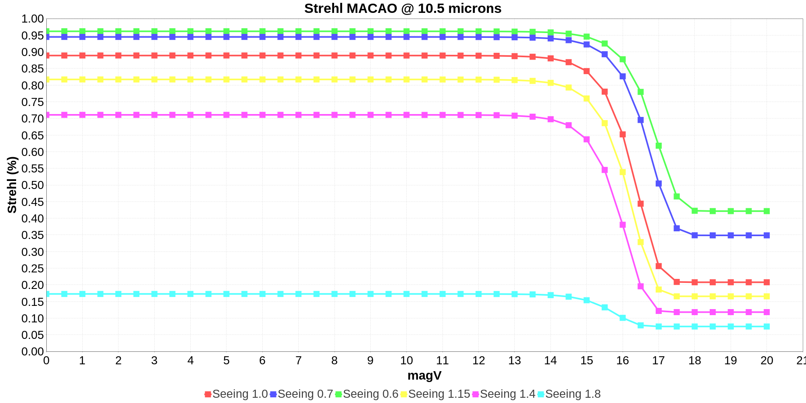

### Telescope: AT

Telescope diameter (m): 1.8

#### Adaptive Optics: AO_NAOMI

AO band: R

- AO setup: NAOMI_BRIGHT

  - AO band: R
  - AO nbSubPupils: 16
  - AO nbActuators: 15
  - AO td: 2.0
  - AO ron: 0.32
  - AO qe: 0.1

  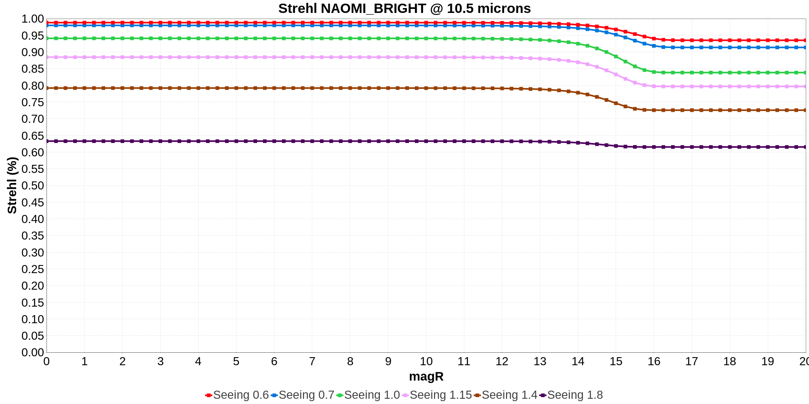

- AO setup: NAOMI_FAINT

  - AO band: R
  - AO nbSubPupils: 16
  - AO nbActuators: 7
  - AO td: 5.0
  - AO ron: 0.32
  - AO qe: 0.1

  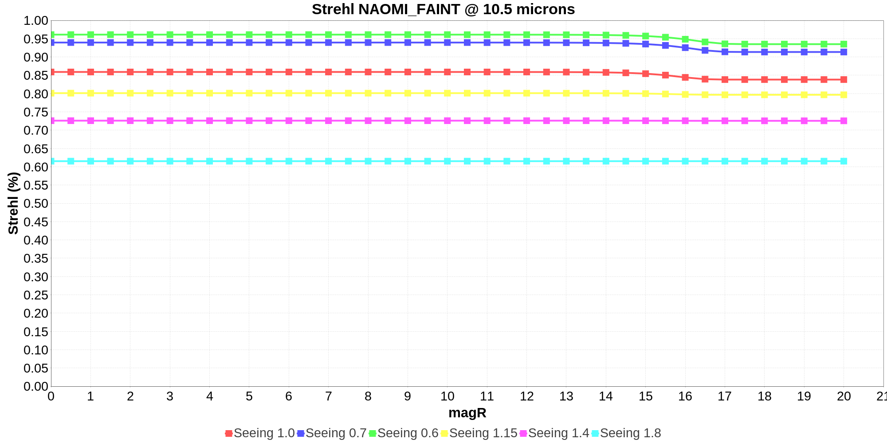

