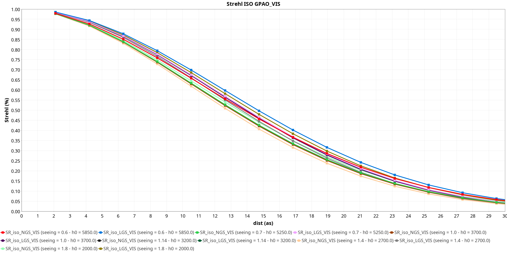
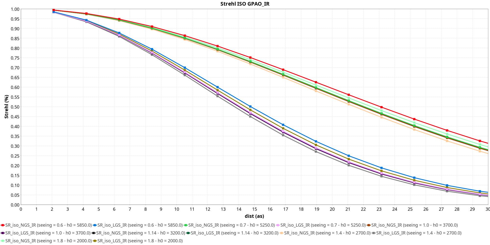

# ASPRO 2 - Strehl ratios per instrument, telescope and Adaptive Optics (AO) systems

- Date: Thu Sep 04 14:02:36 GMT 2025

- InterferometerConfiguration: 'VLTI Period 117'

## Instrument [GRAVITY]

### Instrument Modes [LOW-COMBINED LOW-SPLIT]

- Instrument band: K
- Instrument ref. wavelength : 2.2 µm
- Instrument min. wavelength : 1.96 µm
- Instrument max. wavelength : 2.52 µm

#### Telescope [UT]

- Telescope diameter (m): 8.0

##### Adaptive Optics [AO_GPAO_NGS_VIS]

- AO band: G_RP

- AO setup: 'GPAO_NGS_VIS'

- nbSubPupils: 1600
- nbActuators: 1200
- td (ms):     0.7
- ron (e-/s):  0.2
- Q.E:         0.25
- magOffset:   -1.0
- strehlMax:   0.9

  ![GRAVITY [LOW-COMBINED LOW-SPLIT] UT (GPAO_NGS_VIS) Strehl ratio K vs G_RP mag](GRAVITY_LOW-COMBINED_LOW-SPLIT_UT_GPAO_NGS_VIS_Strehl_ratio_K_vs_G_RP_mag.png)

##### Adaptive Optics [AO_GPAO_LGS_VIS]

- AO band: G_RP

- AO setup: 'GPAO_LGS_VIS'

- nbSubPupils: 900
- nbActuators: 600
- td (ms):     1.6
- ron (e-/s):  0.4
- Q.E:         0.25
- magOffset:   -5.25
- strehlMax:   0.75

  ![GRAVITY [LOW-COMBINED LOW-SPLIT] UT (GPAO_LGS_VIS) Strehl ratio K vs G_RP mag](GRAVITY_LOW-COMBINED_LOW-SPLIT_UT_GPAO_LGS_VIS_Strehl_ratio_K_vs_G_RP_mag.png)

##### Adaptive Optics [AO_GPAO_NGS_IR]

- AO band: K

- AO setup: 'GPAO_NGS_IR'

- nbSubPupils: 81
- nbActuators: 60
- td (ms):     2.0
- ron (e-/s):  60.0
- Q.E:         0.7
- magOffset:   0.0
- strehlMax:   0.0

  ![GRAVITY [LOW-COMBINED LOW-SPLIT] UT (GPAO_NGS_IR) Strehl ratio K vs K mag](GRAVITY_LOW-COMBINED_LOW-SPLIT_UT_GPAO_NGS_IR_Strehl_ratio_K_vs_K_mag.png)

##### Adaptive Optics [AO_GPAO_LGS_IR]

- AO band: K

- AO setup: 'GPAO_LGS_IR'

- nbSubPupils: 900
- nbActuators: 600
- td (ms):     1.6
- ron (e-/s):  0.4
- Q.E:         0.7
- magOffset:   -3.25
- strehlMax:   0.72

  ![GRAVITY [LOW-COMBINED LOW-SPLIT] UT (GPAO_LGS_IR) Strehl ratio K vs K mag](GRAVITY_LOW-COMBINED_LOW-SPLIT_UT_GPAO_LGS_IR_Strehl_ratio_K_vs_K_mag.png)

#### Telescope [AT]

- Telescope diameter (m): 1.8

##### Adaptive Optics [AO_NAOMI]

- AO band: G

- AO setup: 'NAOMI_BRIGHT'

- nbSubPupils: 16
- nbActuators: 15
- td (ms):     2.0
- ron (e-/s):  0.32
- Q.E:         0.1
- magOffset:   0.0
- strehlMax:   0.0

  ![GRAVITY [LOW-COMBINED LOW-SPLIT] AT (NAOMI_BRIGHT) Strehl ratio K vs G mag](GRAVITY_LOW-COMBINED_LOW-SPLIT_AT_NAOMI_BRIGHT_Strehl_ratio_K_vs_G_mag.png)

- AO setup: 'NAOMI_FAINT'

- nbSubPupils: 16
- nbActuators: 7
- td (ms):     5.0
- ron (e-/s):  0.32
- Q.E:         0.1
- magOffset:   0.0
- strehlMax:   0.0

  ![GRAVITY [LOW-COMBINED LOW-SPLIT] AT (NAOMI_FAINT) Strehl ratio K vs G mag](GRAVITY_LOW-COMBINED_LOW-SPLIT_AT_NAOMI_FAINT_Strehl_ratio_K_vs_G_mag.png)

### Instrument Modes [MEDIUM-COMBINED MEDIUM-SPLIT]

- Instrument band: K
- Instrument ref. wavelength : 2.2 µm
- Instrument min. wavelength : 1.96 µm
- Instrument max. wavelength : 2.48 µm

#### Telescope [UT]

- Telescope diameter (m): 8.0

##### Adaptive Optics [AO_GPAO_NGS_VIS]

- AO band: G_RP

- AO setup: 'GPAO_NGS_VIS'

- nbSubPupils: 1600
- nbActuators: 1200
- td (ms):     0.7
- ron (e-/s):  0.2
- Q.E:         0.25
- magOffset:   -1.0
- strehlMax:   0.9

  ![GRAVITY [MEDIUM-COMBINED MEDIUM-SPLIT] UT (GPAO_NGS_VIS) Strehl ratio K vs G_RP mag](GRAVITY_MEDIUM-COMBINED_MEDIUM-SPLIT_UT_GPAO_NGS_VIS_Strehl_ratio_K_vs_G_RP_mag.png)

##### Adaptive Optics [AO_GPAO_LGS_VIS]

- AO band: G_RP

- AO setup: 'GPAO_LGS_VIS'

- nbSubPupils: 900
- nbActuators: 600
- td (ms):     1.6
- ron (e-/s):  0.4
- Q.E:         0.25
- magOffset:   -5.25
- strehlMax:   0.75

  ![GRAVITY [MEDIUM-COMBINED MEDIUM-SPLIT] UT (GPAO_LGS_VIS) Strehl ratio K vs G_RP mag](GRAVITY_MEDIUM-COMBINED_MEDIUM-SPLIT_UT_GPAO_LGS_VIS_Strehl_ratio_K_vs_G_RP_mag.png)

##### Adaptive Optics [AO_GPAO_NGS_IR]

- AO band: K

- AO setup: 'GPAO_NGS_IR'

- nbSubPupils: 81
- nbActuators: 60
- td (ms):     2.0
- ron (e-/s):  60.0
- Q.E:         0.7
- magOffset:   0.0
- strehlMax:   0.0

  ![GRAVITY [MEDIUM-COMBINED MEDIUM-SPLIT] UT (GPAO_NGS_IR) Strehl ratio K vs K mag](GRAVITY_MEDIUM-COMBINED_MEDIUM-SPLIT_UT_GPAO_NGS_IR_Strehl_ratio_K_vs_K_mag.png)

##### Adaptive Optics [AO_GPAO_LGS_IR]

- AO band: K

- AO setup: 'GPAO_LGS_IR'

- nbSubPupils: 900
- nbActuators: 600
- td (ms):     1.6
- ron (e-/s):  0.4
- Q.E:         0.7
- magOffset:   -3.25
- strehlMax:   0.72

  ![GRAVITY [MEDIUM-COMBINED MEDIUM-SPLIT] UT (GPAO_LGS_IR) Strehl ratio K vs K mag](GRAVITY_MEDIUM-COMBINED_MEDIUM-SPLIT_UT_GPAO_LGS_IR_Strehl_ratio_K_vs_K_mag.png)

#### Telescope [AT]

- Telescope diameter (m): 1.8

##### Adaptive Optics [AO_NAOMI]

- AO band: G

- AO setup: 'NAOMI_BRIGHT'

- nbSubPupils: 16
- nbActuators: 15
- td (ms):     2.0
- ron (e-/s):  0.32
- Q.E:         0.1
- magOffset:   0.0
- strehlMax:   0.0

  ![GRAVITY [MEDIUM-COMBINED MEDIUM-SPLIT] AT (NAOMI_BRIGHT) Strehl ratio K vs G mag](GRAVITY_MEDIUM-COMBINED_MEDIUM-SPLIT_AT_NAOMI_BRIGHT_Strehl_ratio_K_vs_G_mag.png)

- AO setup: 'NAOMI_FAINT'

- nbSubPupils: 16
- nbActuators: 7
- td (ms):     5.0
- ron (e-/s):  0.32
- Q.E:         0.1
- magOffset:   0.0
- strehlMax:   0.0

  ![GRAVITY [MEDIUM-COMBINED MEDIUM-SPLIT] AT (NAOMI_FAINT) Strehl ratio K vs G mag](GRAVITY_MEDIUM-COMBINED_MEDIUM-SPLIT_AT_NAOMI_FAINT_Strehl_ratio_K_vs_G_mag.png)

### Instrument Modes [HIGH-COMBINED HIGH-SPLIT]

- Instrument band: K
- Instrument ref. wavelength : 2.2 µm
- Instrument min. wavelength : 1.96 µm
- Instrument max. wavelength : 2.4 µm

#### Telescope [UT]

- Telescope diameter (m): 8.0

##### Adaptive Optics [AO_GPAO_NGS_VIS]

- AO band: G_RP

- AO setup: 'GPAO_NGS_VIS'

- nbSubPupils: 1600
- nbActuators: 1200
- td (ms):     0.7
- ron (e-/s):  0.2
- Q.E:         0.25
- magOffset:   -1.0
- strehlMax:   0.9

  ![GRAVITY [HIGH-COMBINED HIGH-SPLIT] UT (GPAO_NGS_VIS) Strehl ratio K vs G_RP mag](GRAVITY_HIGH-COMBINED_HIGH-SPLIT_UT_GPAO_NGS_VIS_Strehl_ratio_K_vs_G_RP_mag.png)

##### Adaptive Optics [AO_GPAO_LGS_VIS]

- AO band: G_RP

- AO setup: 'GPAO_LGS_VIS'

- nbSubPupils: 900
- nbActuators: 600
- td (ms):     1.6
- ron (e-/s):  0.4
- Q.E:         0.25
- magOffset:   -5.25
- strehlMax:   0.75

  ![GRAVITY [HIGH-COMBINED HIGH-SPLIT] UT (GPAO_LGS_VIS) Strehl ratio K vs G_RP mag](GRAVITY_HIGH-COMBINED_HIGH-SPLIT_UT_GPAO_LGS_VIS_Strehl_ratio_K_vs_G_RP_mag.png)

##### Adaptive Optics [AO_GPAO_NGS_IR]

- AO band: K

- AO setup: 'GPAO_NGS_IR'

- nbSubPupils: 81
- nbActuators: 60
- td (ms):     2.0
- ron (e-/s):  60.0
- Q.E:         0.7
- magOffset:   0.0
- strehlMax:   0.0

  ![GRAVITY [HIGH-COMBINED HIGH-SPLIT] UT (GPAO_NGS_IR) Strehl ratio K vs K mag](GRAVITY_HIGH-COMBINED_HIGH-SPLIT_UT_GPAO_NGS_IR_Strehl_ratio_K_vs_K_mag.png)

##### Adaptive Optics [AO_GPAO_LGS_IR]

- AO band: K

- AO setup: 'GPAO_LGS_IR'

- nbSubPupils: 900
- nbActuators: 600
- td (ms):     1.6
- ron (e-/s):  0.4
- Q.E:         0.7
- magOffset:   -3.25
- strehlMax:   0.72

  ![GRAVITY [HIGH-COMBINED HIGH-SPLIT] UT (GPAO_LGS_IR) Strehl ratio K vs K mag](GRAVITY_HIGH-COMBINED_HIGH-SPLIT_UT_GPAO_LGS_IR_Strehl_ratio_K_vs_K_mag.png)

#### Telescope [AT]

- Telescope diameter (m): 1.8

##### Adaptive Optics [AO_NAOMI]

- AO band: G

- AO setup: 'NAOMI_BRIGHT'

- nbSubPupils: 16
- nbActuators: 15
- td (ms):     2.0
- ron (e-/s):  0.32
- Q.E:         0.1
- magOffset:   0.0
- strehlMax:   0.0

  ![GRAVITY [HIGH-COMBINED HIGH-SPLIT] AT (NAOMI_BRIGHT) Strehl ratio K vs G mag](GRAVITY_HIGH-COMBINED_HIGH-SPLIT_AT_NAOMI_BRIGHT_Strehl_ratio_K_vs_G_mag.png)

- AO setup: 'NAOMI_FAINT'

- nbSubPupils: 16
- nbActuators: 7
- td (ms):     5.0
- ron (e-/s):  0.32
- Q.E:         0.1
- magOffset:   0.0
- strehlMax:   0.0

  ![GRAVITY [HIGH-COMBINED HIGH-SPLIT] AT (NAOMI_FAINT) Strehl ratio K vs G mag](GRAVITY_HIGH-COMBINED_HIGH-SPLIT_AT_NAOMI_FAINT_Strehl_ratio_K_vs_G_mag.png)

## Instrument [MATISSE_LM]

### Instrument Modes [SI_PHOT_L_LOW]

- Instrument band: L
- Instrument ref. wavelength : 3.5 µm
- Instrument min. wavelength : 2.85 µm
- Instrument max. wavelength : 4.19 µm

#### Telescope [UT]

- Telescope diameter (m): 8.0

##### Adaptive Optics [AO_GPAO_NGS_VIS]

- AO band: G_RP

- AO setup: 'GPAO_NGS_VIS'

- nbSubPupils: 1600
- nbActuators: 1200
- td (ms):     0.7
- ron (e-/s):  0.2
- Q.E:         0.25
- magOffset:   -1.0
- strehlMax:   0.9

  ![MATISSE_LM [SI_PHOT_L_LOW] UT (GPAO_NGS_VIS) Strehl ratio L vs G_RP mag](MATISSE_LM_SI_PHOT_L_LOW_UT_GPAO_NGS_VIS_Strehl_ratio_L_vs_G_RP_mag.png)

##### Adaptive Optics [AO_GPAO_LGS_VIS]

- AO band: G_RP

- AO setup: 'GPAO_LGS_VIS'

- nbSubPupils: 900
- nbActuators: 600
- td (ms):     1.6
- ron (e-/s):  0.4
- Q.E:         0.25
- magOffset:   -5.25
- strehlMax:   0.75

  ![MATISSE_LM [SI_PHOT_L_LOW] UT (GPAO_LGS_VIS) Strehl ratio L vs G_RP mag](MATISSE_LM_SI_PHOT_L_LOW_UT_GPAO_LGS_VIS_Strehl_ratio_L_vs_G_RP_mag.png)

#### Telescope [AT]

- Telescope diameter (m): 1.8

##### Adaptive Optics [AO_NAOMI]

- AO band: G

- AO setup: 'NAOMI_BRIGHT'

- nbSubPupils: 16
- nbActuators: 15
- td (ms):     2.0
- ron (e-/s):  0.32
- Q.E:         0.1
- magOffset:   0.0
- strehlMax:   0.0

  ![MATISSE_LM [SI_PHOT_L_LOW] AT (NAOMI_BRIGHT) Strehl ratio L vs G mag](MATISSE_LM_SI_PHOT_L_LOW_AT_NAOMI_BRIGHT_Strehl_ratio_L_vs_G_mag.png)

- AO setup: 'NAOMI_FAINT'

- nbSubPupils: 16
- nbActuators: 7
- td (ms):     5.0
- ron (e-/s):  0.32
- Q.E:         0.1
- magOffset:   0.0
- strehlMax:   0.0

  ![MATISSE_LM [SI_PHOT_L_LOW] AT (NAOMI_FAINT) Strehl ratio L vs G mag](MATISSE_LM_SI_PHOT_L_LOW_AT_NAOMI_FAINT_Strehl_ratio_L_vs_G_mag.png)

### Instrument Modes [SI_PHOT_LM_LOW]

- Instrument band: L
- Instrument ref. wavelength : 3.5 µm
- Instrument min. wavelength : 2.85 µm
- Instrument max. wavelength : 4.9 µm

#### Telescope [UT]

- Telescope diameter (m): 8.0

##### Adaptive Optics [AO_GPAO_NGS_VIS]

- AO band: G_RP

- AO setup: 'GPAO_NGS_VIS'

- nbSubPupils: 1600
- nbActuators: 1200
- td (ms):     0.7
- ron (e-/s):  0.2
- Q.E:         0.25
- magOffset:   -1.0
- strehlMax:   0.9

  ![MATISSE_LM [SI_PHOT_LM_LOW] UT (GPAO_NGS_VIS) Strehl ratio L vs G_RP mag](MATISSE_LM_SI_PHOT_LM_LOW_UT_GPAO_NGS_VIS_Strehl_ratio_L_vs_G_RP_mag.png)

##### Adaptive Optics [AO_GPAO_LGS_VIS]

- AO band: G_RP

- AO setup: 'GPAO_LGS_VIS'

- nbSubPupils: 900
- nbActuators: 600
- td (ms):     1.6
- ron (e-/s):  0.4
- Q.E:         0.25
- magOffset:   -5.25
- strehlMax:   0.75

  ![MATISSE_LM [SI_PHOT_LM_LOW] UT (GPAO_LGS_VIS) Strehl ratio L vs G_RP mag](MATISSE_LM_SI_PHOT_LM_LOW_UT_GPAO_LGS_VIS_Strehl_ratio_L_vs_G_RP_mag.png)

#### Telescope [AT]

- Telescope diameter (m): 1.8

##### Adaptive Optics [AO_NAOMI]

- AO band: G

- AO setup: 'NAOMI_BRIGHT'

- nbSubPupils: 16
- nbActuators: 15
- td (ms):     2.0
- ron (e-/s):  0.32
- Q.E:         0.1
- magOffset:   0.0
- strehlMax:   0.0

  ![MATISSE_LM [SI_PHOT_LM_LOW] AT (NAOMI_BRIGHT) Strehl ratio L vs G mag](MATISSE_LM_SI_PHOT_LM_LOW_AT_NAOMI_BRIGHT_Strehl_ratio_L_vs_G_mag.png)

- AO setup: 'NAOMI_FAINT'

- nbSubPupils: 16
- nbActuators: 7
- td (ms):     5.0
- ron (e-/s):  0.32
- Q.E:         0.1
- magOffset:   0.0
- strehlMax:   0.0

  ![MATISSE_LM [SI_PHOT_LM_LOW] AT (NAOMI_FAINT) Strehl ratio L vs G mag](MATISSE_LM_SI_PHOT_LM_LOW_AT_NAOMI_FAINT_Strehl_ratio_L_vs_G_mag.png)

### Instrument Modes [SI_PHOT_M_LOW]

- Instrument band: M
- Instrument ref. wavelength : 4.75 µm
- Instrument min. wavelength : 4.48 µm
- Instrument max. wavelength : 5.0 µm

#### Telescope [UT]

- Telescope diameter (m): 8.0

##### Adaptive Optics [AO_GPAO_NGS_VIS]

- AO band: G_RP

- AO setup: 'GPAO_NGS_VIS'

- nbSubPupils: 1600
- nbActuators: 1200
- td (ms):     0.7
- ron (e-/s):  0.2
- Q.E:         0.25
- magOffset:   -1.0
- strehlMax:   0.9

  ![MATISSE_LM [SI_PHOT_M_LOW] UT (GPAO_NGS_VIS) Strehl ratio M vs G_RP mag](MATISSE_LM_SI_PHOT_M_LOW_UT_GPAO_NGS_VIS_Strehl_ratio_M_vs_G_RP_mag.png)

##### Adaptive Optics [AO_GPAO_LGS_VIS]

- AO band: G_RP

- AO setup: 'GPAO_LGS_VIS'

- nbSubPupils: 900
- nbActuators: 600
- td (ms):     1.6
- ron (e-/s):  0.4
- Q.E:         0.25
- magOffset:   -5.25
- strehlMax:   0.75

  ![MATISSE_LM [SI_PHOT_M_LOW] UT (GPAO_LGS_VIS) Strehl ratio M vs G_RP mag](MATISSE_LM_SI_PHOT_M_LOW_UT_GPAO_LGS_VIS_Strehl_ratio_M_vs_G_RP_mag.png)

#### Telescope [AT]

- Telescope diameter (m): 1.8

##### Adaptive Optics [AO_NAOMI]

- AO band: G

- AO setup: 'NAOMI_BRIGHT'

- nbSubPupils: 16
- nbActuators: 15
- td (ms):     2.0
- ron (e-/s):  0.32
- Q.E:         0.1
- magOffset:   0.0
- strehlMax:   0.0

  ![MATISSE_LM [SI_PHOT_M_LOW] AT (NAOMI_BRIGHT) Strehl ratio M vs G mag](MATISSE_LM_SI_PHOT_M_LOW_AT_NAOMI_BRIGHT_Strehl_ratio_M_vs_G_mag.png)

- AO setup: 'NAOMI_FAINT'

- nbSubPupils: 16
- nbActuators: 7
- td (ms):     5.0
- ron (e-/s):  0.32
- Q.E:         0.1
- magOffset:   0.0
- strehlMax:   0.0

  ![MATISSE_LM [SI_PHOT_M_LOW] AT (NAOMI_FAINT) Strehl ratio M vs G mag](MATISSE_LM_SI_PHOT_M_LOW_AT_NAOMI_FAINT_Strehl_ratio_M_vs_G_mag.png)

### Instrument Modes [SI_PHOT_LM_MEDIUM]

- Instrument band: L
- Instrument ref. wavelength : 3.5 µm
- Instrument min. wavelength : 2.79 µm
- Instrument max. wavelength : 4.99 µm

#### Telescope [UT]

- Telescope diameter (m): 8.0

##### Adaptive Optics [AO_GPAO_NGS_VIS]

- AO band: G_RP

- AO setup: 'GPAO_NGS_VIS'

- nbSubPupils: 1600
- nbActuators: 1200
- td (ms):     0.7
- ron (e-/s):  0.2
- Q.E:         0.25
- magOffset:   -1.0
- strehlMax:   0.9

  ![MATISSE_LM [SI_PHOT_LM_MEDIUM] UT (GPAO_NGS_VIS) Strehl ratio L vs G_RP mag](MATISSE_LM_SI_PHOT_LM_MEDIUM_UT_GPAO_NGS_VIS_Strehl_ratio_L_vs_G_RP_mag.png)

##### Adaptive Optics [AO_GPAO_LGS_VIS]

- AO band: G_RP

- AO setup: 'GPAO_LGS_VIS'

- nbSubPupils: 900
- nbActuators: 600
- td (ms):     1.6
- ron (e-/s):  0.4
- Q.E:         0.25
- magOffset:   -5.25
- strehlMax:   0.75

  ![MATISSE_LM [SI_PHOT_LM_MEDIUM] UT (GPAO_LGS_VIS) Strehl ratio L vs G_RP mag](MATISSE_LM_SI_PHOT_LM_MEDIUM_UT_GPAO_LGS_VIS_Strehl_ratio_L_vs_G_RP_mag.png)

#### Telescope [AT]

- Telescope diameter (m): 1.8

##### Adaptive Optics [AO_NAOMI]

- AO band: G

- AO setup: 'NAOMI_BRIGHT'

- nbSubPupils: 16
- nbActuators: 15
- td (ms):     2.0
- ron (e-/s):  0.32
- Q.E:         0.1
- magOffset:   0.0
- strehlMax:   0.0

  ![MATISSE_LM [SI_PHOT_LM_MEDIUM] AT (NAOMI_BRIGHT) Strehl ratio L vs G mag](MATISSE_LM_SI_PHOT_LM_MEDIUM_AT_NAOMI_BRIGHT_Strehl_ratio_L_vs_G_mag.png)

- AO setup: 'NAOMI_FAINT'

- nbSubPupils: 16
- nbActuators: 7
- td (ms):     5.0
- ron (e-/s):  0.32
- Q.E:         0.1
- magOffset:   0.0
- strehlMax:   0.0

  ![MATISSE_LM [SI_PHOT_LM_MEDIUM] AT (NAOMI_FAINT) Strehl ratio L vs G mag](MATISSE_LM_SI_PHOT_LM_MEDIUM_AT_NAOMI_FAINT_Strehl_ratio_L_vs_G_mag.png)

### Instrument Modes [SI_PHOT_L_HIGH]

- Instrument band: L
- Instrument ref. wavelength : 3.5 µm
- Instrument min. wavelength : 2.81 µm
- Instrument max. wavelength : 4.2 µm

#### Telescope [UT]

- Telescope diameter (m): 8.0

##### Adaptive Optics [AO_GPAO_NGS_VIS]

- AO band: G_RP

- AO setup: 'GPAO_NGS_VIS'

- nbSubPupils: 1600
- nbActuators: 1200
- td (ms):     0.7
- ron (e-/s):  0.2
- Q.E:         0.25
- magOffset:   -1.0
- strehlMax:   0.9

  ![MATISSE_LM [SI_PHOT_L_HIGH] UT (GPAO_NGS_VIS) Strehl ratio L vs G_RP mag](MATISSE_LM_SI_PHOT_L_HIGH_UT_GPAO_NGS_VIS_Strehl_ratio_L_vs_G_RP_mag.png)

##### Adaptive Optics [AO_GPAO_LGS_VIS]

- AO band: G_RP

- AO setup: 'GPAO_LGS_VIS'

- nbSubPupils: 900
- nbActuators: 600
- td (ms):     1.6
- ron (e-/s):  0.4
- Q.E:         0.25
- magOffset:   -5.25
- strehlMax:   0.75

  ![MATISSE_LM [SI_PHOT_L_HIGH] UT (GPAO_LGS_VIS) Strehl ratio L vs G_RP mag](MATISSE_LM_SI_PHOT_L_HIGH_UT_GPAO_LGS_VIS_Strehl_ratio_L_vs_G_RP_mag.png)

#### Telescope [AT]

- Telescope diameter (m): 1.8

##### Adaptive Optics [AO_NAOMI]

- AO band: G

- AO setup: 'NAOMI_BRIGHT'

- nbSubPupils: 16
- nbActuators: 15
- td (ms):     2.0
- ron (e-/s):  0.32
- Q.E:         0.1
- magOffset:   0.0
- strehlMax:   0.0

  ![MATISSE_LM [SI_PHOT_L_HIGH] AT (NAOMI_BRIGHT) Strehl ratio L vs G mag](MATISSE_LM_SI_PHOT_L_HIGH_AT_NAOMI_BRIGHT_Strehl_ratio_L_vs_G_mag.png)

- AO setup: 'NAOMI_FAINT'

- nbSubPupils: 16
- nbActuators: 7
- td (ms):     5.0
- ron (e-/s):  0.32
- Q.E:         0.1
- magOffset:   0.0
- strehlMax:   0.0

  ![MATISSE_LM [SI_PHOT_L_HIGH] AT (NAOMI_FAINT) Strehl ratio L vs G mag](MATISSE_LM_SI_PHOT_L_HIGH_AT_NAOMI_FAINT_Strehl_ratio_L_vs_G_mag.png)

### Instrument Modes [SI_PHOT_L_VERY_HIGH]

- Instrument band: L
- Instrument ref. wavelength : 3.9 µm
- Instrument min. wavelength : 3.68 µm
- Instrument max. wavelength : 4.13 µm

#### Telescope [UT]

- Telescope diameter (m): 8.0

##### Adaptive Optics [AO_GPAO_NGS_VIS]

- AO band: G_RP

- AO setup: 'GPAO_NGS_VIS'

- nbSubPupils: 1600
- nbActuators: 1200
- td (ms):     0.7
- ron (e-/s):  0.2
- Q.E:         0.25
- magOffset:   -1.0
- strehlMax:   0.9

  ![MATISSE_LM [SI_PHOT_L_VERY_HIGH] UT (GPAO_NGS_VIS) Strehl ratio L vs G_RP mag](MATISSE_LM_SI_PHOT_L_VERY_HIGH_UT_GPAO_NGS_VIS_Strehl_ratio_L_vs_G_RP_mag.png)

##### Adaptive Optics [AO_GPAO_LGS_VIS]

- AO band: G_RP

- AO setup: 'GPAO_LGS_VIS'

- nbSubPupils: 900
- nbActuators: 600
- td (ms):     1.6
- ron (e-/s):  0.4
- Q.E:         0.25
- magOffset:   -5.25
- strehlMax:   0.75

  ![MATISSE_LM [SI_PHOT_L_VERY_HIGH] UT (GPAO_LGS_VIS) Strehl ratio L vs G_RP mag](MATISSE_LM_SI_PHOT_L_VERY_HIGH_UT_GPAO_LGS_VIS_Strehl_ratio_L_vs_G_RP_mag.png)

#### Telescope [AT]

- Telescope diameter (m): 1.8

##### Adaptive Optics [AO_NAOMI]

- AO band: G

- AO setup: 'NAOMI_BRIGHT'

- nbSubPupils: 16
- nbActuators: 15
- td (ms):     2.0
- ron (e-/s):  0.32
- Q.E:         0.1
- magOffset:   0.0
- strehlMax:   0.0

  ![MATISSE_LM [SI_PHOT_L_VERY_HIGH] AT (NAOMI_BRIGHT) Strehl ratio L vs G mag](MATISSE_LM_SI_PHOT_L_VERY_HIGH_AT_NAOMI_BRIGHT_Strehl_ratio_L_vs_G_mag.png)

- AO setup: 'NAOMI_FAINT'

- nbSubPupils: 16
- nbActuators: 7
- td (ms):     5.0
- ron (e-/s):  0.32
- Q.E:         0.1
- magOffset:   0.0
- strehlMax:   0.0

  ![MATISSE_LM [SI_PHOT_L_VERY_HIGH] AT (NAOMI_FAINT) Strehl ratio L vs G mag](MATISSE_LM_SI_PHOT_L_VERY_HIGH_AT_NAOMI_FAINT_Strehl_ratio_L_vs_G_mag.png)

### Instrument Modes [SI_PHOT_M_VERY_HIGH]

- Instrument band: M
- Instrument ref. wavelength : 4.75 µm
- Instrument min. wavelength : 4.57 µm
- Instrument max. wavelength : 5.0 µm

#### Telescope [UT]

- Telescope diameter (m): 8.0

##### Adaptive Optics [AO_GPAO_NGS_VIS]

- AO band: G_RP

- AO setup: 'GPAO_NGS_VIS'

- nbSubPupils: 1600
- nbActuators: 1200
- td (ms):     0.7
- ron (e-/s):  0.2
- Q.E:         0.25
- magOffset:   -1.0
- strehlMax:   0.9

  ![MATISSE_LM [SI_PHOT_M_VERY_HIGH] UT (GPAO_NGS_VIS) Strehl ratio M vs G_RP mag](MATISSE_LM_SI_PHOT_M_VERY_HIGH_UT_GPAO_NGS_VIS_Strehl_ratio_M_vs_G_RP_mag.png)

##### Adaptive Optics [AO_GPAO_LGS_VIS]

- AO band: G_RP

- AO setup: 'GPAO_LGS_VIS'

- nbSubPupils: 900
- nbActuators: 600
- td (ms):     1.6
- ron (e-/s):  0.4
- Q.E:         0.25
- magOffset:   -5.25
- strehlMax:   0.75

  ![MATISSE_LM [SI_PHOT_M_VERY_HIGH] UT (GPAO_LGS_VIS) Strehl ratio M vs G_RP mag](MATISSE_LM_SI_PHOT_M_VERY_HIGH_UT_GPAO_LGS_VIS_Strehl_ratio_M_vs_G_RP_mag.png)

#### Telescope [AT]

- Telescope diameter (m): 1.8

##### Adaptive Optics [AO_NAOMI]

- AO band: G

- AO setup: 'NAOMI_BRIGHT'

- nbSubPupils: 16
- nbActuators: 15
- td (ms):     2.0
- ron (e-/s):  0.32
- Q.E:         0.1
- magOffset:   0.0
- strehlMax:   0.0

  ![MATISSE_LM [SI_PHOT_M_VERY_HIGH] AT (NAOMI_BRIGHT) Strehl ratio M vs G mag](MATISSE_LM_SI_PHOT_M_VERY_HIGH_AT_NAOMI_BRIGHT_Strehl_ratio_M_vs_G_mag.png)

- AO setup: 'NAOMI_FAINT'

- nbSubPupils: 16
- nbActuators: 7
- td (ms):     5.0
- ron (e-/s):  0.32
- Q.E:         0.1
- magOffset:   0.0
- strehlMax:   0.0

  ![MATISSE_LM [SI_PHOT_M_VERY_HIGH] AT (NAOMI_FAINT) Strehl ratio M vs G mag](MATISSE_LM_SI_PHOT_M_VERY_HIGH_AT_NAOMI_FAINT_Strehl_ratio_M_vs_G_mag.png)

## Instrument [MATISSE_N]

### Instrument Modes [HIGH_SENS_N_LOW]

- Instrument band: N
- Instrument ref. wavelength : 10.5 µm
- Instrument min. wavelength : 7.91 µm
- Instrument max. wavelength : 13.03 µm

#### Telescope [UT]

- Telescope diameter (m): 8.0

##### Adaptive Optics [AO_GPAO_NGS_VIS]

- AO band: G_RP

- AO setup: 'GPAO_NGS_VIS'

- nbSubPupils: 1600
- nbActuators: 1200
- td (ms):     0.7
- ron (e-/s):  0.2
- Q.E:         0.25
- magOffset:   -1.0
- strehlMax:   0.9

  ![MATISSE_N [HIGH_SENS_N_LOW] UT (GPAO_NGS_VIS) Strehl ratio N vs G_RP mag](MATISSE_N_HIGH_SENS_N_LOW_UT_GPAO_NGS_VIS_Strehl_ratio_N_vs_G_RP_mag.png)

##### Adaptive Optics [AO_GPAO_LGS_VIS]

- AO band: G_RP

- AO setup: 'GPAO_LGS_VIS'

- nbSubPupils: 900
- nbActuators: 600
- td (ms):     1.6
- ron (e-/s):  0.4
- Q.E:         0.25
- magOffset:   -5.25
- strehlMax:   0.75

  ![MATISSE_N [HIGH_SENS_N_LOW] UT (GPAO_LGS_VIS) Strehl ratio N vs G_RP mag](MATISSE_N_HIGH_SENS_N_LOW_UT_GPAO_LGS_VIS_Strehl_ratio_N_vs_G_RP_mag.png)

#### Telescope [AT]

- Telescope diameter (m): 1.8

##### Adaptive Optics [AO_NAOMI]

- AO band: G

- AO setup: 'NAOMI_BRIGHT'

- nbSubPupils: 16
- nbActuators: 15
- td (ms):     2.0
- ron (e-/s):  0.32
- Q.E:         0.1
- magOffset:   0.0
- strehlMax:   0.0

  ![MATISSE_N [HIGH_SENS_N_LOW] AT (NAOMI_BRIGHT) Strehl ratio N vs G mag](MATISSE_N_HIGH_SENS_N_LOW_AT_NAOMI_BRIGHT_Strehl_ratio_N_vs_G_mag.png)

- AO setup: 'NAOMI_FAINT'

- nbSubPupils: 16
- nbActuators: 7
- td (ms):     5.0
- ron (e-/s):  0.32
- Q.E:         0.1
- magOffset:   0.0
- strehlMax:   0.0

  ![MATISSE_N [HIGH_SENS_N_LOW] AT (NAOMI_FAINT) Strehl ratio N vs G mag](MATISSE_N_HIGH_SENS_N_LOW_AT_NAOMI_FAINT_Strehl_ratio_N_vs_G_mag.png)

### Instrument Modes [HIGH_SENS_N_HIGH]

- Instrument band: N
- Instrument ref. wavelength : 10.5 µm
- Instrument min. wavelength : 7.9 µm
- Instrument max. wavelength : 13.0 µm

#### Telescope [UT]

- Telescope diameter (m): 8.0

##### Adaptive Optics [AO_GPAO_NGS_VIS]

- AO band: G_RP

- AO setup: 'GPAO_NGS_VIS'

- nbSubPupils: 1600
- nbActuators: 1200
- td (ms):     0.7
- ron (e-/s):  0.2
- Q.E:         0.25
- magOffset:   -1.0
- strehlMax:   0.9

  ![MATISSE_N [HIGH_SENS_N_HIGH] UT (GPAO_NGS_VIS) Strehl ratio N vs G_RP mag](MATISSE_N_HIGH_SENS_N_HIGH_UT_GPAO_NGS_VIS_Strehl_ratio_N_vs_G_RP_mag.png)

##### Adaptive Optics [AO_GPAO_LGS_VIS]

- AO band: G_RP

- AO setup: 'GPAO_LGS_VIS'

- nbSubPupils: 900
- nbActuators: 600
- td (ms):     1.6
- ron (e-/s):  0.4
- Q.E:         0.25
- magOffset:   -5.25
- strehlMax:   0.75

  ![MATISSE_N [HIGH_SENS_N_HIGH] UT (GPAO_LGS_VIS) Strehl ratio N vs G_RP mag](MATISSE_N_HIGH_SENS_N_HIGH_UT_GPAO_LGS_VIS_Strehl_ratio_N_vs_G_RP_mag.png)

#### Telescope [AT]

- Telescope diameter (m): 1.8

##### Adaptive Optics [AO_NAOMI]

- AO band: G

- AO setup: 'NAOMI_BRIGHT'

- nbSubPupils: 16
- nbActuators: 15
- td (ms):     2.0
- ron (e-/s):  0.32
- Q.E:         0.1
- magOffset:   0.0
- strehlMax:   0.0

  ![MATISSE_N [HIGH_SENS_N_HIGH] AT (NAOMI_BRIGHT) Strehl ratio N vs G mag](MATISSE_N_HIGH_SENS_N_HIGH_AT_NAOMI_BRIGHT_Strehl_ratio_N_vs_G_mag.png)

- AO setup: 'NAOMI_FAINT'

- nbSubPupils: 16
- nbActuators: 7
- td (ms):     5.0
- ron (e-/s):  0.32
- Q.E:         0.1
- magOffset:   0.0
- strehlMax:   0.0

  ![MATISSE_N [HIGH_SENS_N_HIGH] AT (NAOMI_FAINT) Strehl ratio N vs G mag](MATISSE_N_HIGH_SENS_N_HIGH_AT_NAOMI_FAINT_Strehl_ratio_N_vs_G_mag.png)

## Instrument [PIONIER]

### Instrument Modes [GRISM-H FREE-H]

- Instrument band: H
- Instrument ref. wavelength : 1.65 µm
- Instrument min. wavelength : 1.5 µm
- Instrument max. wavelength : 1.79 µm

#### Telescope [UT]

- Telescope diameter (m): 8.0

##### Adaptive Optics [AO_GPAO_NGS_VIS]

- AO band: G_RP

- AO setup: 'GPAO_NGS_VIS'

- nbSubPupils: 1600
- nbActuators: 1200
- td (ms):     0.7
- ron (e-/s):  0.2
- Q.E:         0.25
- magOffset:   -1.0
- strehlMax:   0.9

  ![PIONIER [GRISM-H FREE-H] UT (GPAO_NGS_VIS) Strehl ratio H vs G_RP mag](PIONIER_GRISM-H_FREE-H_UT_GPAO_NGS_VIS_Strehl_ratio_H_vs_G_RP_mag.png)

##### Adaptive Optics [AO_GPAO_LGS_VIS]

- AO band: G_RP

- AO setup: 'GPAO_LGS_VIS'

- nbSubPupils: 900
- nbActuators: 600
- td (ms):     1.6
- ron (e-/s):  0.4
- Q.E:         0.25
- magOffset:   -5.25
- strehlMax:   0.75

  ![PIONIER [GRISM-H FREE-H] UT (GPAO_LGS_VIS) Strehl ratio H vs G_RP mag](PIONIER_GRISM-H_FREE-H_UT_GPAO_LGS_VIS_Strehl_ratio_H_vs_G_RP_mag.png)

#### Telescope [AT]

- Telescope diameter (m): 1.8

##### Adaptive Optics [AO_NAOMI]

- AO band: G

- AO setup: 'NAOMI_BRIGHT'

- nbSubPupils: 16
- nbActuators: 15
- td (ms):     2.0
- ron (e-/s):  0.32
- Q.E:         0.1
- magOffset:   0.0
- strehlMax:   0.0

  ![PIONIER [GRISM-H FREE-H] AT (NAOMI_BRIGHT) Strehl ratio H vs G mag](PIONIER_GRISM-H_FREE-H_AT_NAOMI_BRIGHT_Strehl_ratio_H_vs_G_mag.png)

- AO setup: 'NAOMI_FAINT'

- nbSubPupils: 16
- nbActuators: 7
- td (ms):     5.0
- ron (e-/s):  0.32
- Q.E:         0.1
- magOffset:   0.0
- strehlMax:   0.0

  ![PIONIER [GRISM-H FREE-H] AT (NAOMI_FAINT) Strehl ratio H vs G mag](PIONIER_GRISM-H_FREE-H_AT_NAOMI_FAINT_Strehl_ratio_H_vs_G_mag.png)

## GPAO VIS:

  

## GPAO IR:

  

